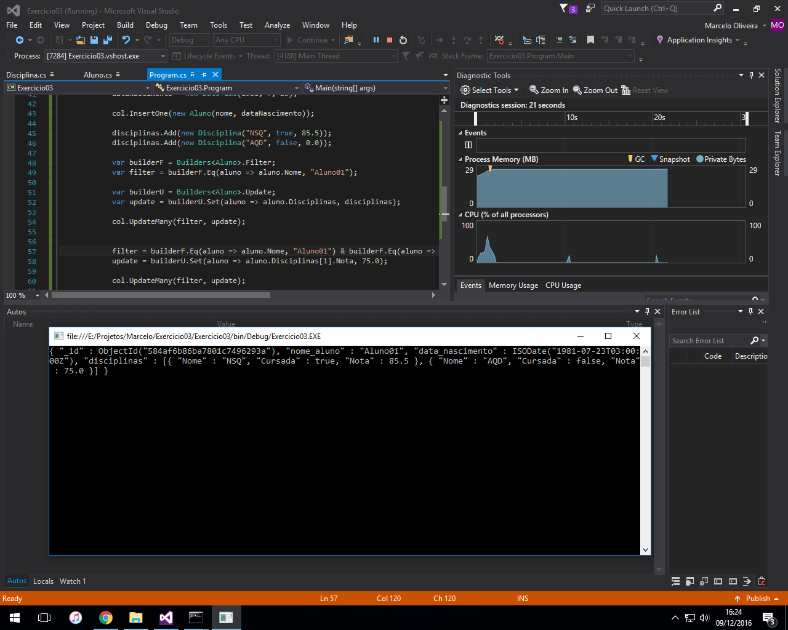

## Exercício 03

###Sistema de cadastro de alunos:

* O sistema deve permitir inserir um novo aluno com nome, data de nascimento
* Adicionar a um aluno disciplinas que está cursando e cursadas
* Adicionar notas de um aluno a uma determinada disciplina
* Adicione esse arquivo em seu github em uma pasta chamada aula2

>Solução disponível [aqui](Exercicio03 "Aplicação C#") (Solução Visual Studio - Projeto em C#).

